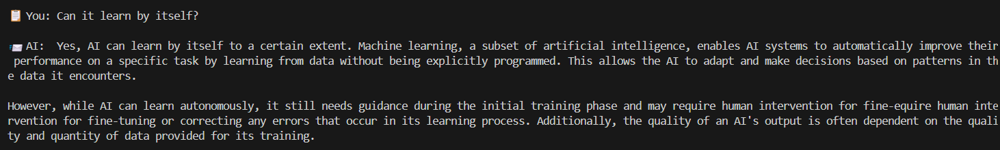

# Agregar memoria al Agente de IA

El agente de IA anterior funciona bien, pero tiene un inconveniente en ese agente. No puede recordar las cosas que le pedimos anteriormente. **Por Ejemplo**, le pedimos al agente la pregunta de "¿Qué es IA?" y respondió correctamente. Acto seguido, cuando le pedimos a la IA "¿Cuál fue la primera pregunta?" no la ha podido recordar.

Cada vez que pregunto algo, lo considera como una nueva pregunta. Así que, ahora mismo, el agente de IA olvida las conversaciones pasadas después de cada respuesta. Entonces, lo que haremos es **Usar la Memoria Conversacional de LangChain** (LangChain´s Conversational Memory) para hacer un seguimiento de las interacciones.

Lo que hay que hacer es instalar primero las **dependencias de memoria**. Luego modificaremos nuestra aplicación existente para agregarle memoria. Para eso lo que vamos a hacer es:

- Volver a la terminal del sistema.

- Instalar una biblioteca llamada langchain_community --> **pip install langchain_community**

- Si recuerdas, ya la hemos instalado, pero si no lo has hecho, asegúrate de que esté instalada.

- Limpiamos la terminal --> **cls** o **clear**

- Volvemos al archivo "basic_ai_agent.py" y vamos a comentar TODO el código desde la primera línea de código. Empezaremos a programar desde ahí arriba del todo el archivo:

```py
# ⬇️⬇️⬇️ Empezaremos el código aquí ⬇️⬇️⬇️

# 🔼🔼🔼 Código aquí 🔼🔼🔼
# from langchain_ollama import OllamaLLM

# Load AI Model from Ollama
# llm = OllamaLLM(model="mistral")

# print("\nWelcome to your Agent IA! Ask me something...")

# while True:
#     question = input("Make your question (or write 'exit' to stop the machine): ")
#     if question.lower() == "exit":
#         print("Good bye, begginner!")
#         break
#     response = llm.invoke(question)
#     print("\n Response for IA: ", response)
```

1. El primer paso es importar el siguiente paquete:

```py
from langchain_community.chat_message_histories import ChatMessageHistory
```
 
Esto importará la clase ChatMessageHistory, que se utiliza para **almacenar y gestionar el historial del chat.** Esto permite que el modelo de IA recuerde interacciones previas en la conversación.

2. A continuación, procedemos a importar el siguiente paquete:

```py
from langchain_core.prompts import PromptTemplate
```

Esto importa una clase de plantilla de prompt que se utiliza para **definir la estructura de los prompts de IA**. Esto ayuda a formatear la entrada antes de enviarla al modelo de IA (mistral).

3. A continuación, procedemos a importar el siguiente paquete:

```py
from langchain_ollama import OllamaLLM
```

Esto es lo mismo que importamos en el anterior código. Esto importa de nuevo OllamaLLM, lo que nos permite **usar un modelo de IA a través de LangChain**. Este es el motor de IA que generará respuestas, así que vamos a proceder a cargar el modelo de IA.

4. Cargamos el modelo de IA con el siguiente código:

```py
llm = OllamaLLM(model="mistral") # Change model to "llama3" or another if needed
```

Esto inicializa el modelo de IA mistral usando Ollama LLM, y el modelo se puede cambiar de nuevo a lo que desees (llama3, deepseek...).

5. Procederemos a inicializar la memoria del chat.

```py
# Inicialize Memory
chat_history = ChatMessageHistory() # Stores user-AI conversation history
```

Lo que hace es crear un historial de memoria de chat para almacenar el historial de conversaciones aquí dentro de este historial de chat. Esto permite al chatbot llevar un registro de lo que se dijo anteriormente.

6. A continuación procedemos a definir la plantilla:

```py
# Define AI Chat Prompt
prompt = PromptTemplate(
    imput_variables=["chat_history", "question"],
    template="Previous conversation: {chat_history}\nUser: {question}\nAI:"
)
```

Esto lo que hace es definir una indicación estructurada que la IA usará con el *chat_history*. El historial será reemplazado con el historial de conversaciones almacenado y la pregunta *question* será reemplazada con la última entrada del usuario. Esto asegura que la IA responda en contexto al ver los mensajes anteriores, así que cada vez estaría recibiendo esos mensajes, pero sabrá cuál fue el historial de chat anterior. Y con base en eso hará un seguimiento de ello.

7. A continuación escribamos la función para manejar el chat de IA con memoria:

```py
def run_chain(question):
```

Esto deine una función que procesa el chat que ocurre adelante y recupera el historial de chat normalmente.

8. Dentro de la función, escribimos lo siguiente:

```py
    # Retrieve chat history manually
    chat_history_text = "\n".join([f"{msg.type.capitalize()}: {msg.content}" for msg in chat_history.messages])
```

Estoy creando este formato para almacenar el historial de chat en un formato legible, y cada mensaje se procesa en usuario. Se almacena aquí el texto del historial del chat.

9. Vamos a proceder a ejecutar la generación de respuesta de la IA:

```py
    # RUN the AI response generation
    response = llm.invoke(prompt.format(chat_history=chat_history_text, question=question))
```

Esto es parecido a llamar a "llm.invoke" que hicimos antes en la creación básica del agente de IA. Así que este será mi **respuesta** (response). Esto enviará el **historial de chat formateado** y la **pregunta del usuario al modelo de IA**. La IA genera la respuesta considerando los mensajes anteriores y la pasa a la respuesta.

10. Vamos a almacenar la nueva entrada del usuario y la respuesta de la IA en la memoria:

```py
    # Store new user input and AI response in memory
    chat_history.add_user_message(question)
    chat_history.add_ai_message(response)
```

"chat_history" guarda la pregunta del usuario y la respuesta de la IA en el historial de chat. Esto asegura que la IA recuerde los mensajes pasados en futuras respuestas.

11. Finalmente, diré "devolver respuesta":

```py
    return response
```

Esto devolverá la respuesta generada por la IA para ser mostrada en el chat.

---

Ahora vamos a proceder a crear el bucle interactivo del chatbot.

```py
# Primero imprimiremos un mensaje de bienvenida
print("\n📤 AI Chatbot with Memory")
print("Type 'exit' to stop.")
# Iniciamos un bucle infinito hasta que el usuario salga del chat
while True:
    # Entrada de usuario input
    user_input = input("\n📋 You: ")
    # Condicion if si la entrada de usuario es igual a 'exit'
    if user_input.lower() == "exit":
        # Imprimimos Goob Bye y terminamos el bucle 'break'
        print("\n👋 Good Bye!!")
        break

    # Llamamos la función run_chain con la nueva entrada de usuario
    ai_response = run_chain(user_input)
    # Imprimimos la respuesta de la IA
    print(f"\n📨 AI: {ai_response}")
```

Esta es toda nuestra aplicación con memoria incorporada, así que vamos a seguir adelante con la terminal, y ejecutar la misma aplicación de nuevo:

```bash
C:\Users\alumno\Desktop\AIAgents\Day1> py basic_ai_agent.py

# Resultado:
📤 AI Chatbot with Memory
Type 'exit' to stop.

📋 You: 

```

Le vamos a preguntar: "What is AI Agent?" (¿Qué es un agente de IA?) El proceso sería el mismo, pero recordará la primera pregunta y lo guardará en la memoria. El resultado sería algo así:


Ahora vamos a preguntar: "Who invented AI?" (¿Quién inventó la IA?). Veamos qué dice:


Ahora preguntamos: Can it learn by itself? (¿Puede aprender por sí mismo?). Veamos qué dice:



Ahora le preguntamos: "What was the first question I asked?* (¿Cual fue la primera pregunta que he preguntado?). Veamos que dice:


Tu pregunta fue: "Qué es un agente de IA?" Si recuerdas, esa fue nuestra primera pregunta. Ahora lo recuerda. Así que tiene un poco el contexto de lo que estoy haciendo. Y de alguna manera retoma la siguiente sesión con ese contexto. Así que lo que sea que preguntes, puedes tener una conversación normal con este agente de IA.

Y finalmente puedo simplemente salir "exit" y se escapa de eso:


 
Así que eso es nuestro añadido. Así es cómo puedes añadir memoria a tu agente de IA. Así que de nuevo, si tuviste algún problema o inconveniente con esto, házmelo saber en los mensajes.

Anterior --> [**Click aquí**](./01d_ConstruirAgenteIASimple.md)

Siguiente --> [**Click aquí**](./01f_Interfazweb.md)