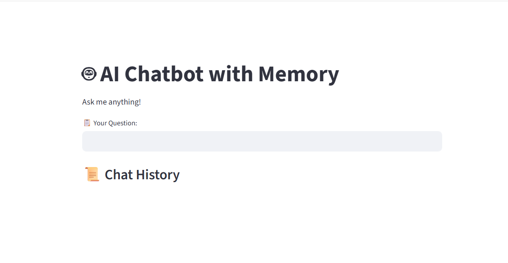
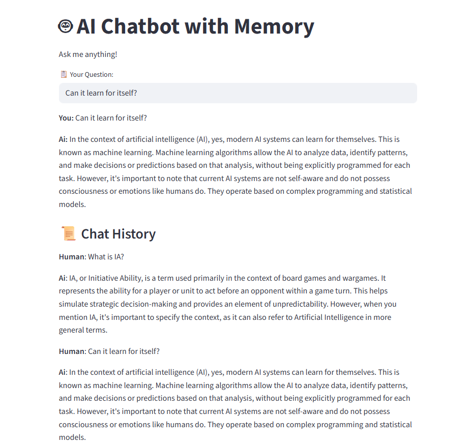
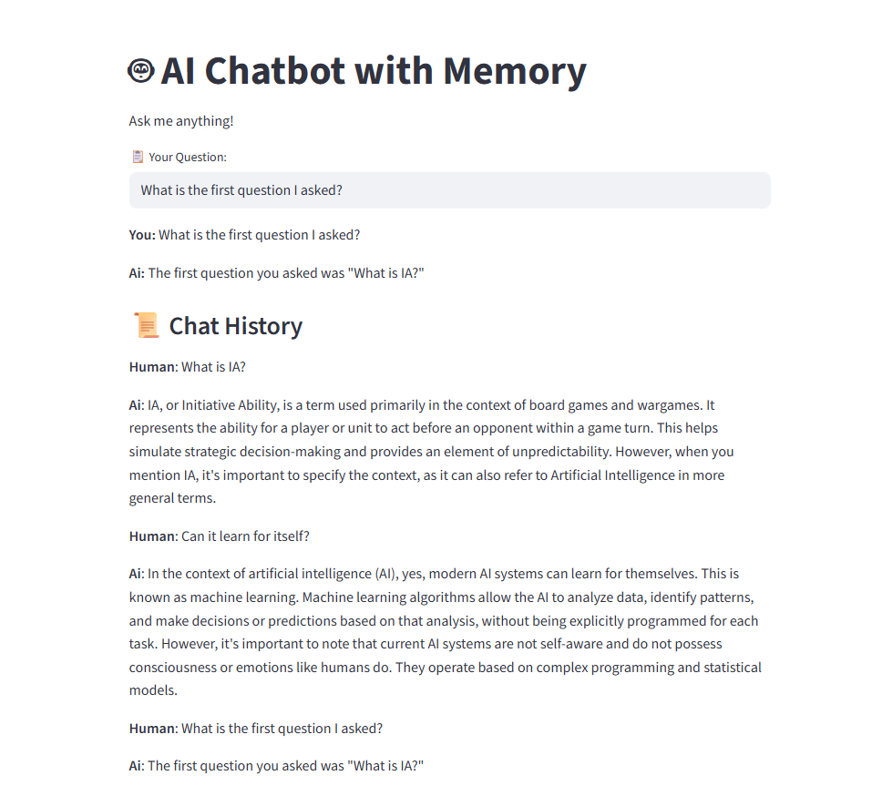

# Crear una Interfaz Web para el Agente de IA

El próximo tema que quiero abordar es la **creación de una interfaz web (Web User Interface)** para un agente de IA.

Ya hemos creado una interfaz de línea de comandos, o cual es genial, pero vamos a añadir una interfaz web utilizando una biblioteca llamada **Streamlit**. Hace todo por tí y es muy útil.

Primero lo que vamos a hacer es **instalar Streamlit**, así que nos dirigimos a la terminal en nuestra ruta:

```bash
C:\Users\alumno\Desktop\AIAgents\Day1>
```

Para instalar la biblioteca, ejecutaremos el siguiente comando:

```bash
pip install streamlit
```

Puedes leer más de Streamlit a través de este enlace --> [docs.stremlit.io](https://docs.streamlit.io/).

## Archivo basic_ai_agent.py

Una vez que hemos instalado la biblioteca, vamos a **crear una interfaz web**. Así que empecemos:

1. Vamos a volver a la misma aplicación que hemos creado, que es nuestro agente de IA básico, y vamos a ir hasta la parte superior para aquí de nuevo comentarlo todo.

Si se prefiere, se puede añadir de esta manera:

```py
# Agente de IA Básico ⬇️⬇️

# from langchain_ollama import OllamaLLM

# Load AI Model from Ollama
# llm = OllamaLLM(model="mistral")

# print("\nWelcome to your Agent IA! Ask me something...")

# while True:
    # question = input("Make your question (or write 'exit' to stop the machine): ")
    # if question.lower() == "exit":
        # print("Good bye, begginner!")
        # break
    # response = llm.invoke(question)
    # print("\n Response for IA: ", response)

# ---------------------------------------------------------------------------------------

# Agente de IA Básico Con Memoria ⬇️⬇️⬇️

# from langchain_community.chat_message_histories import ChatMessageHistory
# from langchain_core.prompts import PromptTemplate
# from langchain_ollama import OllamaLLM

# Load AI Model from Ollama
# llm = OllamaLLM(model="mistral") # Change to "llama3" or another Ollama model

# Inicialize Memory
# chat_history = ChatMessageHistory() # Stores user-AI conversation history

# Define AI Chat Prompt
# prompt = PromptTemplate(
    # imput_variables=["chat_history", "question"],
    # template="Previous conversation: {chat_history}\nUser: {question}\nAI:"
# )

# Function to run AI chat with memory
# def run_chain(question):
    # Retrieve chat history manually
    # chat_history_text = "\n".join([f"{msg.type.capitalize()}: {msg.content}" for msg in chat_history.messages])

    # RUN the AI response generation
    # response = llm.invoke(prompt.format(chat_history=chat_history_text, question=question))

    # Store new user input and AI response in memory
    # chat_history.add_user_message(question)
    # chat_history.add_ai_message(response)

    # return response

# Interactive CLI Chatbot
# print("\n📤 AI Chatbot with Memory")
# print("Type 'exit' to stop.")

# while True:
    # user_input = input("\n📋 You: ")
    # if user_input.lower() == "exit":
        # print("\n👋 Good Bye!!")
        # break

    # ai_response = run_chain(user_input)
    # print(f"\n📨 AI: {ai_response}")

# Agente de IA con Interfaz Web (Aquí es donde empezaría el código) ⬇️⬇️⬇️

```

Guarda el archivo, y una vez hecho importaremos la biblioteca:

```py
import streamlit as st
```

Este es Streamlit, una biblioteca de Python para crear aplicaciones basadas en la web rápidamente. Se utiliza aquí para construir una interfaz de chatbot de IA simple, por eso lo estoy importando.

A continuación, voy a importar el paquete de *historial de mensajes por chat* desde **LangChain Community**:

```py
from langchain_community.chat_message_histories import ChatMessageHistory
```

Nuevamente, esto importa el historial de mensajes de chat, lo cual ayuda a almacenar y gestionar el historial de chat entre el usuario y la IA.

A continuación importamos los dos paquetes que usamos recientemente para la otra versión del agente de IA:

```py
from langchain_core.prompts import PromptTemplate # <-- Para la plantilla del prompt
from langchain_ollama import OllamaLLM # <-- Para conectar con Ollama desd LangChain
```

A continuación, cargaré el modelo de IA:

```py
# Load AI Model from Ollama
llm = OllamaLLM(model="mistral") # Change to "llama3" or another Ollama model
```

Ahora vamos a proceder a inicializar la memoria:

```py
# Inicialize Memory
if "chat_history" not in st.session_state:
    st.session_state.chat_history = ChatMessageHistory() # Stores user-AI conversation history 
```

Esto almacena el historial de conversación del usuario con la IA.

¿Por qué la condición if? Esto verifica si el historial de chat existe en el estado de sesión de Streamlit. Si el historial de chat no está ya configurado, inicializa el historial de chat aquí. Luego con la variable "chat_history" permite que el chatbot recuerde conversaciones pasadas.

A continuación procedemos a definir el chat de IA, empezando por la plantilla:

```py
# Define AI Chat Prompt
prompt = PromptTemplate(
    imput_variables=["chat_history", "question"],
    template="Previous conversation: {chat_history}\nUser: {question}\nAI:"
)
```

Esto nuevamente define cómo se envían los mensajes a la IA.

Vamos a definir la función para ejecutar el chat de IA con memoria. Esto sería exactamente la misma función que tenemos antes:

```py
# Function to run AI chat with memory
def run_chain(question):
```

Pero claro, aquí debemos de modificar la variable "chat_history_text" para que haga conexión con Streamlit. Entonces modificaríamos esta parte:

```py
    # Retrieve chat history manually (st.session_state)
    chat_history_text = "\n".join([f"{msg.type.capitalize()}: {msg.content}" for msg in st.session_state.chat_history.messages])
```

Habría que modificar el bucle for para tomar el punto "st.session_state". A diferencia del otro agente, antes tomaba los mensajes de "chat_history.messages", pero en este caso, estoy diciendo "st.session_state.chat_history.messages".

A continuación vamos a proceder a ejecutar el generador de respuestas de IA "llm":

```py
    # RUN the AI response generation
    response = llm.invoke(prompt.format(chat_history=chat_history_text, question=question))
```

Ahora a almacenar la nueva entrada del usuario y la respuesta de la IA en la memoria, pero usando Streamlit (st.session_state):

```py
    # Store new user input and AI response in memory
    st.session_state.chat_history.add_user_message(question)
    st.session_state.chat_history.add_ai_message(response)
```

Y luego devuelve la respuesta de la función run_chain:

```py
    return response
```

---

Esto va a ser nuevo para nosotros, así que primero vamos a crear primero el título con Streamlit:

```py
# Streamlit UI
st.title("🤖 AI Chatbot with Memory ")
```

Este será el título que mostramos de manera prominente. A continuación voy a escribir:

```py
st.write("Ask me anything!")
```

Así que esto se mostrará el mensaje "Pregúntame lo que sea!".

A continuación, vamos a crear algo para la entrada del usuario:

```py
user_input = st.text_input("📋 Your Question:")
```

Esto creará un campo de entrada de texto para que el usuario escriba su pregunta. Así que cuando abras el navegador, verás de qué estoy hablando.

Siguiente proceso, a procesar la entrada del usuario:

```py
if user_input:
    response = run_chain(user_input)
```

Ahora, si la respuesta de entrada del usuario es igual a ejecutar cada de entrada del usuario, se le llama a la función, obtiene la respuesta y dirá lo siguiente:

```py
    # Dentro de if
    st.write(f"**You:** {user_input}")
    st.write(f"**Ai:** {response}")
```

La IA dió esta respuesta. Aahora, si el usuario ingresa, una pregunta pasará por esto, ejecutará la cadena y la enviará a la IA para obtener una respuesta. 

Las preguntas del usuario y la respuesta de la IA se muestran en la interfaz web utilizando estos mensajes.

A continuación, vamos a seguir adelante y mostrar el historial completo del chat:

```py
# Show full chat history
st.subheader("📜 Chat History")
```

Esto muestra el cabecero del historial completo del chat en la interfaz. Lo siguiente es un bucle para recorrer el historial del chat e imprimir cada mensaje. Así que voy a decir:

```py
for msg in st.session_state.chat_history.messages:
    st.write(f"**{msg.type.capitalize()}**: {msg.content}")
```

Así que esa es toda nuestra aplicación. Lo que hace es nuevamente crear una aplicación web con Streamlit donde los usuarios pueden chatear con la IA. La IA recuerda conversaciones pasadas que se almacenan en el estado de sesión y muestra el historial completo de la conversación de manera dinámica.

## Prueba

Nos volvemos a la terminal con nuestra ruta que tenga el archivo del agente de IA y ejecutaremos el siguiente comando:

```bash
streamlit run basic_ai_agent.py
```

Nos muestra en la terminal para abrir una URL como así:


Una vez ejecutado el comando nos aparece por defecto esta ventana en el navegador:



Si no se abre, puedes simplemente ir a la terminal y copiar la URL local (http://localhost:8501) para luego abrirlo en el navegador, y te mostrará lo mismo nuevamente.

Ahora como puedes ver, el título que hemos espicificado antes (st.title), que es "AI Chatbot with Memory" se muestra en pantalla. Y luego también "Ask me anything!" desde la línea después del título (st.write) aparece en pantalla.

"📋 Your Question:" también se muestra como cabecero del input para especificar una pregunta.

El historial de chat está ahí, pero no hay chat. Por eso está vacío. Voy a preguntar: "What is IA Agent?". Veamos que ocurre:


Así ya vemos que está funcionando y me da la respuesta, y también el historial. ¿Qué dijo el humano (Human)? ¿Qué dijo la IA?

Ahora vamos a hacer otra pregunta: "Can it learn for itself?". Veamos qué ocurre:



Vemos que aquí ya lo está almacenando todo en el espacio del historial. Ahora vamos a preguntarle: "What is the first question I asked?" Veamos qué dice:



Como puedes ver, se almacena la respuesta en el historial y lo recuerda.

Y con esto, ya tienes tu chatbot completo con memoria disponible en un sitio web. Así que creamos un chatbot basado en la web usando Streamlit. Prueba esto y déjame saber cómo te va.

Si tienes alguna pregunta o tuviste algún problema al implementarlo, déjame saber en los comentarios.

Y con esto se finaliza el día 1, así que espero que hayas disfrutado de este primer día. Nos veremos en el día 2. 👋

Anterior página: Agregar Memoria --> [**Click aquí**](./01e_AgregarMemoria.md)

Pasar al día 2 --> [**Click aquí**](../Day2/02_Intro.md)