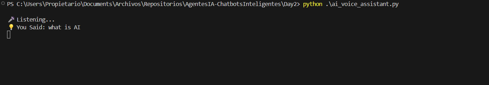
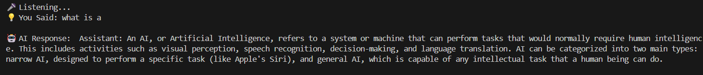
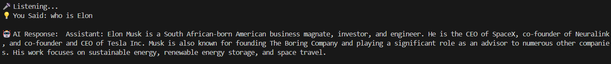
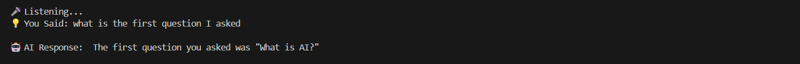
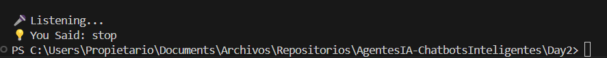

# Ejecutar el Asistente de IA

Ahora procederemos a ejecutar el asistente de IA. Así que, sólo para culminar, ya hemos escrito el código en el archivo "ai_voice_assistant.py". Ya sabemos cómo funcion este asistente de IA.

Vamos a iniciar nuestro asistente de IA controlado por voz empezando por abrir nuestro termianl y ejecutando el siguiente comando:

```bash
python ai_voice_assistant.py
```

Antes que nada, asegurémonos de que estemos en la carpeta correcta para ejecutar el comando:

```bash
PS C:\Users\alumno\Desktop\AIAgents\Day1> cd ..
PS C:\Users\alumno\Desktop\AIAgents> cd Day2
PS C:\Users\alumno\Desktop\AIAgents\Day2> ls 


    Directorio: C:\Users\alumno\Desktop\AIAgents\Day2>


Mode                 LastWriteTime         Length Name
----                 -------------         ------ ----
-a----        01/02/2026      1:54           2268 ai_voice_assistant.py


PS C:\Users\alumno\Desktop\AIAgents\Day2> 
```

Una vez que estemos en la carpeta correcta, podemos ejecutar el archivo "ai_voice_assistant.py" con el comando "python".

Una vez ejecutado, compruebe si tiene los altavoces activados y que no esté silenciado el ordenador.

En principio vamos a probar a decir por nosotros mismos esta pregunta: "What is AI?"



Nos devolverá una respuesta como ésta:



Ahora preguntemos "Who is Elon Musk?"



Tal vez se nos haya comido alguna palabra que pueda entender la IA, pero al menos ha cogido la información necesaria.

Ahora comprobaremos si tiene memorizado la primera pregunta que le hicimos:



Por esto hemos comprobado que se almacenó el historial de datos a buen recaudo.

Eso sí, si tardamos un poco en hacer una pregunta nos va pidiendo todo el rato para especificr otra pregunta:


Si ya queremos que se pare la máquina, tendremos que decir "exit" o "stop":



Y listo! Ya tenemos a nuestro propio asistente de IA respondiendo a nuestros comandos de voz.

Espero que hayas podido seguir y hacer que esto funcione. Es cierto que no ha podido captar correctamente lo que queremos pedir a la máquina, pero pudo responder a nuestros mensajes a la perfección.

## Error común

- ModuleNotFoundError: No module named 'pyaudio'

Si te sale este error, significa que debemos instalar el módulo "pyaudio" para comprobar el sonido de voz. Para ello hay que ejecutar el siguiente comando:

```py
pip install pyaudio
```

Con esto debería de funcionar. Si surge algún otro problema, coméntame en los comentarios.

Anterior --> [**Click aquí**](./02c_ArrancarAsistente.md)