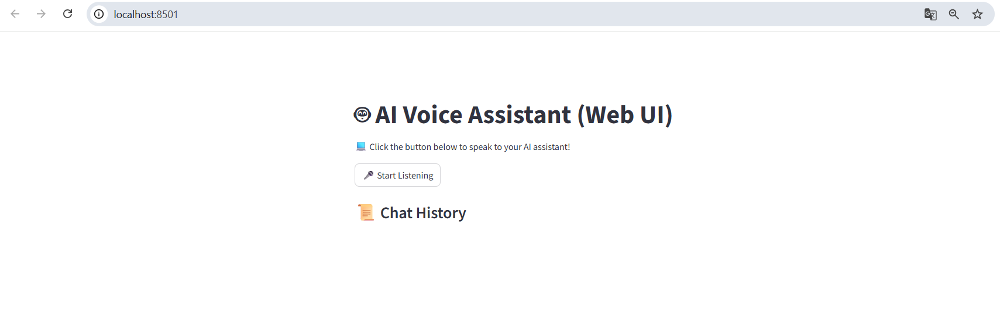
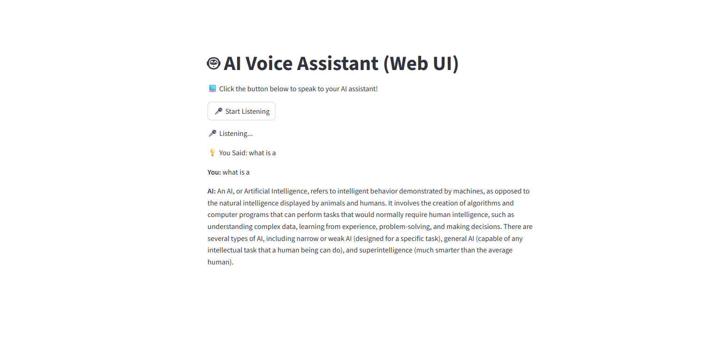
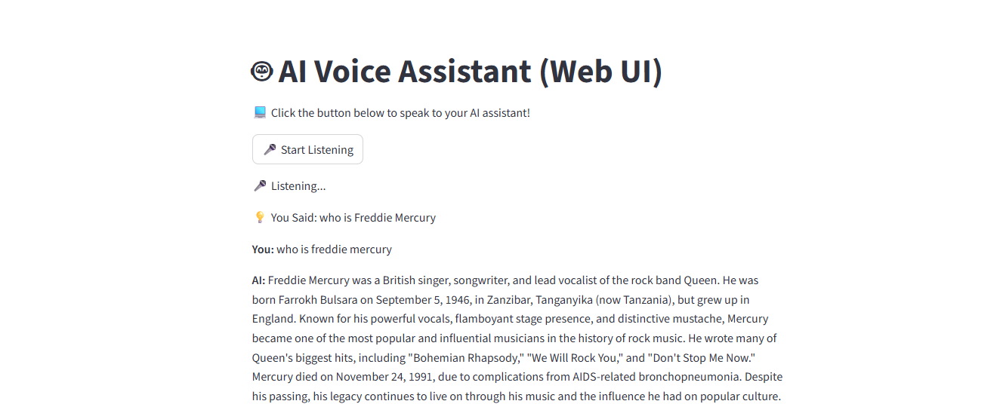

# Crear un Asistente de Voz de IA Basado en Web

Vamos a proceder a crear un **asistente de voz basado en la web**. Esta vez crearemos un nuevo archivo llamado *ai_voice_assistant_ui.py*.

## Cómo funciona el asistente de voz de IA basado en la web

Antes de escribir código, vamos a entender qué hace nuestro asistente de voz en la web:

- El usuario hace click en el botón de "Start Listening" en la interfaz web.

- La IA escucha la voz del usuario y la convierte en texto.

- La IA procesa la consulta usando *Ollama*.

- La IA responde y pronuncia la respuesta.

- El historial de chat se muestra en la interfaz.

Esta vez tendremos una mejor interfaz que puede ser presentada a otra persona o añadida como un proyecto en tu portafolio.

Entonces sigamos adelante y escribamos el código. Una vez escrito el código, ejecutaremos el siguiente comando para arrancar el asistente de voz de IA basado en web usando la aplicación *Streamlit*:

```bash
streamlit run ai_voice_assistant_ui.py
```

Para empezar, nos dirigiremos a nuestro símbolo de sistema con la ruta del día 2 (C:\Users\alumno\Desktop\AIAgents\Day2>). 

Desde nuestra carpeta crearemos un nuevo archivo, cuya mayor parte del código será similar al anterior asistente de voz, pero lo crearemos de todos modos. Lo llmaremos "ai_voice_assistant_ui.py".

Cómo se mencionó antes, la mayor parte del código será el mismo, porque la lógica es exactamente la misma. Así que vamos a intentar resumirlo un poco desde el principio para que sea bastante fácil de entender basado en lo que hicimos en el otro archivo.

Vamos a empezar por importar los siguientes módulos:

```py
import streamlit as st
import speech_recognition as sr
import pyttsx3
from langchain_community.chat_message_histories import ChatMessageHistory
from langchain_core.prompts import PromptTemplate
from langchain_ollama import OllamaLLM
```

A continuación vamos a proceder a crear nuestro motor de arranque para el modelo de IA:

```py
# Load AI Model
llm = OllamaLLM(model="mistral") # Change to "llama3" or another Ollama model
```

Luego iniciaremos la memoria en el historial de chat:

```py
# Initialize Memory (LangChain v1.0+)
if "chat_history" not in st.session_state:
    st.session_state.chat_history = ChatMessageHistory() # Stores user-AI conversation history
```

Le decimos que si "chat_history" no está en el estado de sesión en Streamlit, se va a crear uno similar a lo que hicimos antes.

A continuación, inicializamos el motor de texto a voz:

```py
# Initialize Text-to-Speech Engine
engine = pyttsx3.init()
engine.setProperty("rate", 160) # Adjust speaking speed
```

A continuación añadiremos el reconocimiento de voz:

```py
# Speech Recognition
recognizer = sr.Recognizer()
```

Después añadiremos la función "speak" para que hable la máquina:

```py
# Function to Speak
def speak(text):
    engine.say(text)
    engine.runAndWait()
```

A continuación, escribiremos la función para escuchar:

```py
# Function to Listen
def listen():
    with sr.Microphone() as source:
        st.write("\n🎤 Listening...")
        recognizer.adjust_for_ambient_noise(source)
        audio = recognizer.listen(source)
    try:
        query = recognizer.recognize_google(audio)
        st.write(f"💡 You Said: {query}")
        return query.lower()
    except sr.UnknownValueError:
        st.write("🤖 Sorry, I couldn`t understand. Try again!")
        return ""
    except sr.RequestError:
        st.write("☣️ Speech Recognition Service Unavailable")
        return ""
```

Aquí vemos que la función "listen" no cambia mucho, sólo que las líneas 3, 8, 11 y 14 de la función se cambian las funciones "print" por "st.write" para que Streamlit imprima por texto los resultados en la web.

A continucación vamos a definir nuestro mensaje de chat de IA.

```py
# AI Chat Prompt
prompt = PromptTemplate(
    imput_variables=["chat_history", "question"],
    template="Previous conversation: {chat_history}\nUser: {question}\nAI:",
)
```

Ahora escribiremos la función para procesar las respuestas de la IA:

```py
# Function to Process AI Responses
def run_chain(question):
    # Retrieve past chat history manually
    chat_history_text = "\n".join([f"{msg.type.capitalize()}: {msg.content}" for msg in st.session_state.chat_history.messages])

    # RUN the AI response generation
    response = llm.invoke(prompt.format(chat_history=chat_history_text, question=question))

    # Store new user input and AI response in memory
    st.session_state.chat_history.add_user_message(question)
    st.session_state.chat_history.add_ai_message(response)

    return response
```

Ahora vamos a diseñar nuestra interfaz web de Streamlit. Primero vamos a escribir un título que muestre la interfaz web del asistente de voz de IA, y un párrafo que describe su propósito:

```py
# Streamlit Web UI
st.title("🤖 AI Voice Assistant (Web UI)")
st.write("💻 Click the button below to speak to your AI assistant!")
```

En "st.write" nos pone que hagammos click en el botón de abajo para hablar con sus asistente de IA. Este es ell botón para grabar la entrada de voz:

```py
# Button to Record Voice Input
if st.button("🎤 Start Listening"):
    user_query = listen()
```

Esto comenzará tan pronto como el usuario presione ese botón, comenzará a escuchar y escuchará a la consulta del usuario. 

Dentro de la función "if" añadiremos esto:

```py
    if user_query:
        ai_response = run_chain(user_query)
        st.write(f"**You** {user_query}")
        st.write(f"**AI:** {ai_response}")
        speak(ai_response) # AI speaks the response
```

Si la consulta del usuario está presente (if user_query:) escribiré que la respuesta de la IA ejecuta la cadena de consulta del usuario (ai_response = run_chain(user_query)). 

Lo que sea que dijimos la consulta del usuario se muestra al usuario (st.write(f"**You** {user_query}")). 

A continuación lo que sea por el usuario diga, voy a mostrar esa respuesta (st.write(f"**AI:** {ai_response}")).

Y después escribimos "Habla la respuesta de la IA" (speak(ai_response)) que surge finalmente.

Al final mostraremos el historial completo del chat:

```py
# Display Full Chat History
st.subheader("📜 Chat History")
for msg in st.session_state.chat_history.messages:
    st.write(f"**{msg.type.capitalize()}**: {msg.content}")
```

Pondremos un encabezado (st.subheader("📜 Chat History")) para el historial del chat. Después haremos un bucle con los mensajes almacenados (for msg in st.session_state.chat_history.messages:). Nos escribirá los mensajes (st.write(f"**{msg.type.capitalize()}**: {msg.content}")) capitalizando la primera letra.

Así que esa es toda nuestra aplicación donde se ejecutará en una interfaz web. 🎉

Así que empezaremos a ejecutarla con el comando mencionado antes:

```bash
streamlit run ai_voice_assistant_ui.py
```

Una vez ejecutado, se nos abre el navegador y la terminal se vería parecido a esto:

```bash
PS C:\Users\alumno\Desktop\AIAgents\Day2> streamlit run .\ai_voice_assistant_ui.py

  You can now view your Streamlit app in your browser.

  Local URL: http://localhost:8501
  Network URL: http://x.x.x.x:8501 # <-- Tu dirección IP

```

En el navegador, nos saldría algo así:



Para usarlo, sólo debemos pulsar el botón y preguntar: "what is ia?". Esperamos un momento y nos saldría así:



Con esta primera pregunta nos lo almacenará en el historial del chat. Ahora preguntamos: "who is Freddy Mercury?":



Y listo! Ya nos lo guarda las preguntas que le hagamos en el historial del chat y con esto concluye nuestra aplicación 🎉🎉

Espero que lo hayas conseguido y hayas llegado hasta aquí.

Día siguiente --> [**Click aquí**](../Day3/03_Intro.md)

Anterior --> [**Click aquí**](./02d_EjecutarAsistente.md)