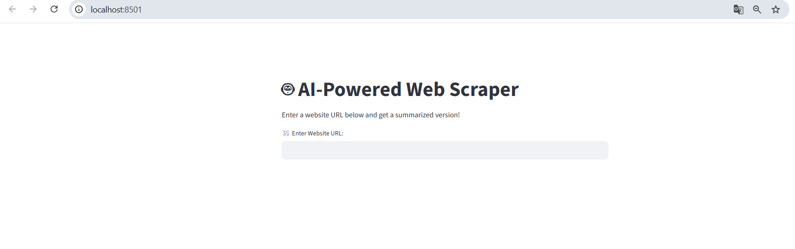
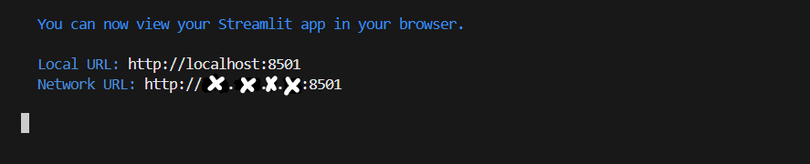
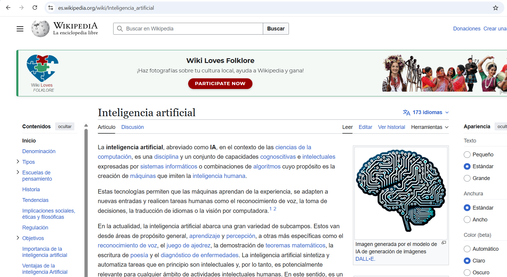
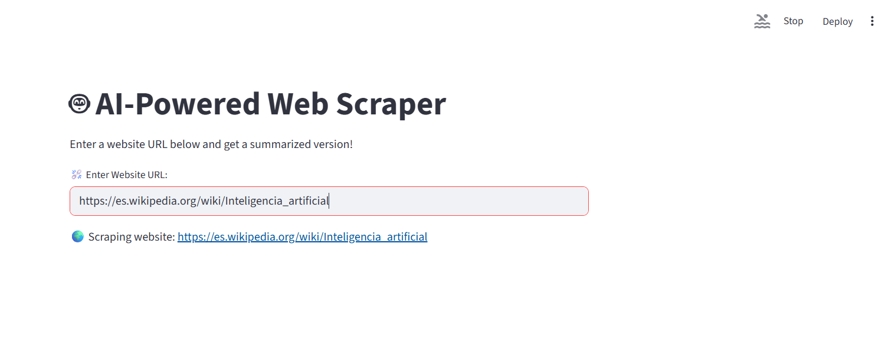
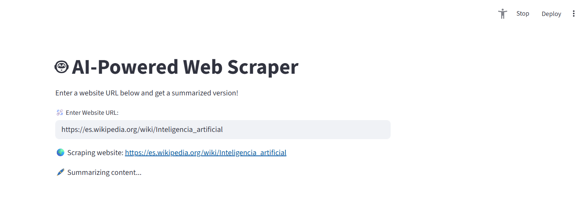
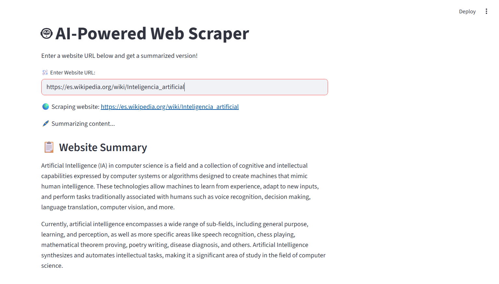
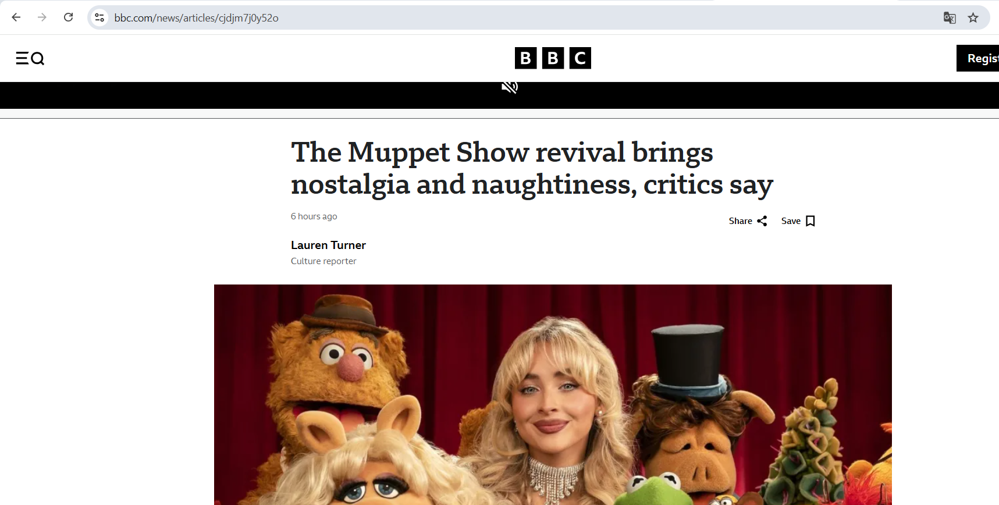
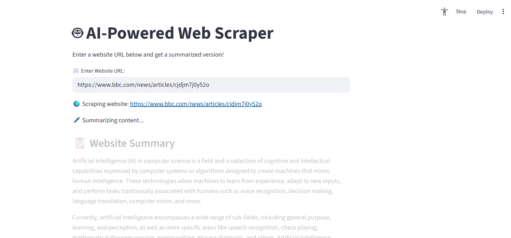
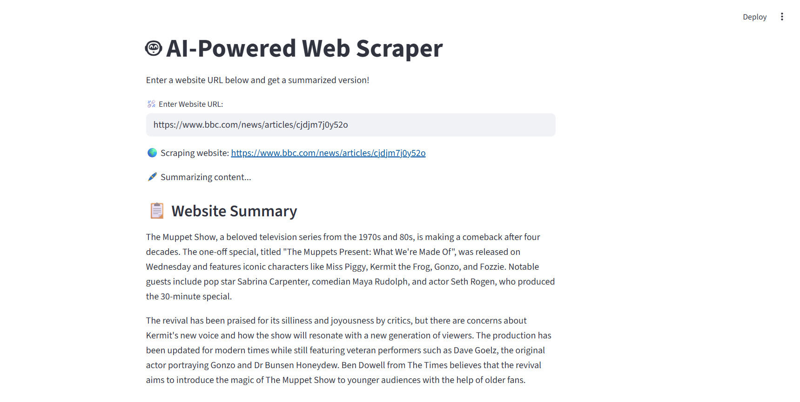

# Ejecutar el Web Scraper de IA

Vamos a ejecutar nuestro raspador web de IA que escribimos en el anterior código.

Para iniciar el raspador web potenciado por IA, habrá que abrir la terminal y dirigirnos a la ruta donde se encuentra el archivo "ai_web_scraper.py":

*C:\Users\alumno\Desktop\AIAgents\Day3>*

Una vez que estemos dentro de la carpeta "Day3", ejecutaremos el siguiente comando:

```bash
streamlit run ai_web_scraper.py
```

Una vez ejecutado, en principio nos redirigiría a nuestro navegador con esta ventana:



Aquí como puedes ver dice de titulo "raspador web potenciado por IA" y de descripción "Ingresa una URL de un sitio web y consigue una versión resumida!".

Si por algún casual no te salta al navegador, simplemente vuelve a la terminal y cópiate uno de estos enlaces: localhost:8501 o x.x.x.x:8501 (x marca los números de tu dirección IP).



---

En la web nos está pidiendo que ingrese una *URL de sitio web*, así que para la URL del sitio web voy a plantar una URL de la wikipedia, que muestra esta página:



Tomamos su URL, lo pegaremos en la entrada del raspador y presionamos Enter:



Va a ejecutarse. Está cargando el sitio web:



Está raspando el sitio web, obteniendo el contenido resumido. En ocasioanes, puede tardar unos minutos en cargar el resumen.

Aquí lo tenemos:



Nos ha conseguido su contenido resumido.

Ahora quiero raspar un sitio web de la bbc:



Vamos a hacer lo mismo: copiar la URL del sitio pegarlo en el puesto de entrada de usuario:



Se está ejecutando. Démosle unos minutos a que genere el resumen.

Ahí lo tienes:



Nos sale todo resumido. Con los personajes que hay en la película de los Muppets, y cómo se produce esa película

Así que nada, ya tenemos nuestra aplicación en funcionamiento. Espero que hayas podido seguir y hacer que esto funcione.

Anterior página: Funcionalidad Web Scrapper --> [**Click aquí**](./03c_FuncionScraper.md)

Siguiente página: Almacenar Datos Extraídos en una Base de Datos Vectorial --> [**Click aquí**](./03e_DataBaseScraper.md)
