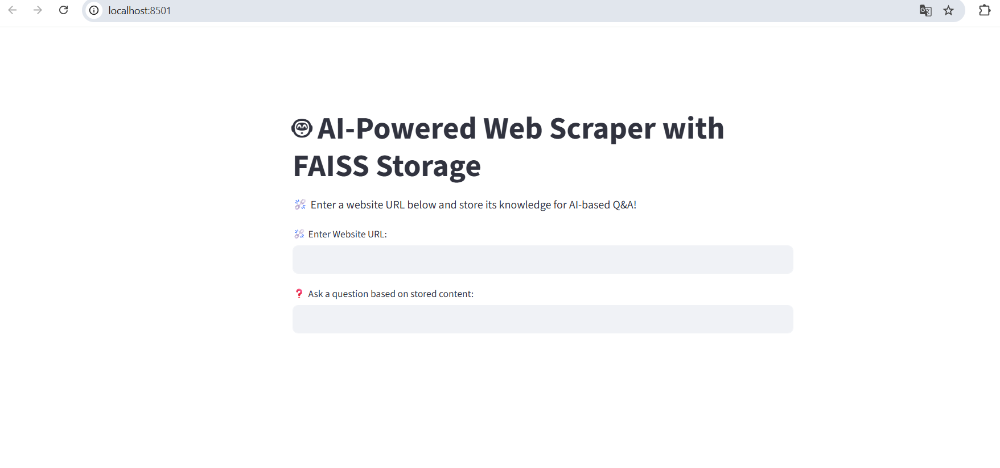
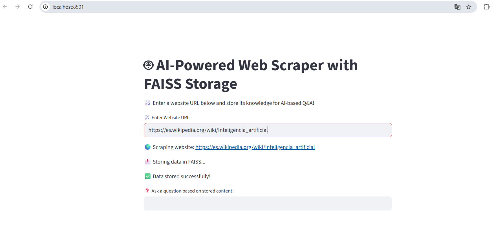
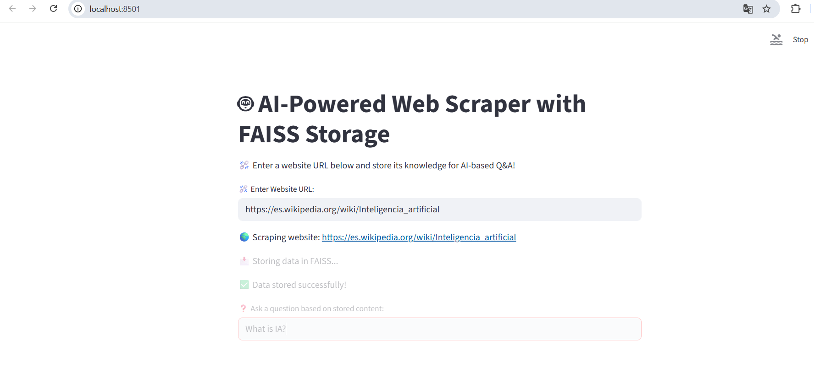
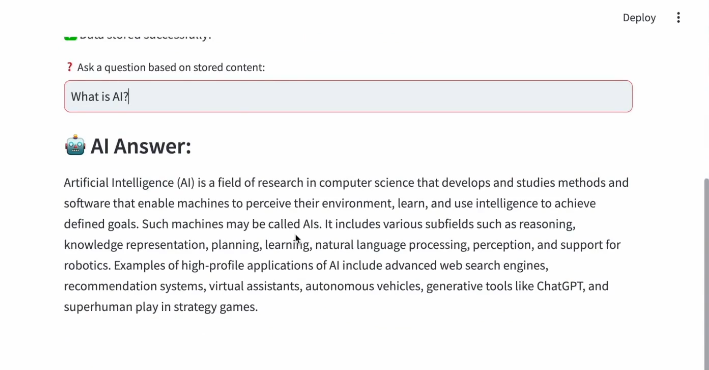

# Almacenar Datos Extraídos en una Base de datos Vectorial

Lo que vamos a hacer aquí es **mejorar** nuestro raspador web con estas mejoras:

- Almacenamos el contenido web extraído en una *base de datos vectorial* que es **FAISS**.

- Permitimos a los usuarios *buscar en el conocimiento almacenado*.

- Recuperaremos *contenido relevante* usando IA.

Así que empecemos:

1. Primero instalaremos las dependencias necesarias.

2. Modificaremos los raspadores web de IA para almacenar datos en archivos donde:

- Primero extraeremos el sitio web.

- Luego incrustaremos el contenido.

- Después lo almacenaremos en los archivos o en la base de datos vectorial (FAISS).

- Al final, habilitaremos la búsqueda potenciada por IA en este contenido almacenado.

---

## Archivo nuevo

Primero vamos a ir a la terminal en nuestra ruta:

*C:\Users\alumno\Desktop\AIAgents\Day3>*

En lugar de actualizar nuestra aplicación (ai_web_scraper.py) vamos a mantenerla tal y como está. Crearemos un archivo nuevo y lo guardaremos como nombre "ai_web_scrapper_faiss.py". Así ya podemos empezar a escribir código.

## Dependencias necesarias

Lo primero que necesitamos hacer es asegurarnos de haber instalado todas nuestras dependencias. Para esto, tenemos que volver a la *terminal* y asegurarme de que todas nuestras dependencias estén instaladas. 

Esto incluye también instalar lo que ya hemos instalado anteriormente, así que haremos un recuento de los paquetes instalados y los que vamos a instalar a continuación:

```bash
pip install requests beautifulsoup4 langchain_ollama faiss-cpu chromadb streamlit
```

Ejecutamos el comando y, después de instalar dependencias, limpiamos la terminal (*cls* o *clear*)

## Recuento de dependencias ya instalados 

Por si no viste --> [03a_Dependencias](./03a_InstalarDependencias.md):

1. **requests** --> Obtiene datos de páginas web.

2. **beautifulsoup4** --> Extrae y limpia texto de HTML.

3. **langchain_ollama** --> Usa Ollama para el *resumen impulsado con IA* (AI-powered summarization).

4. **streamlit** --> Construye una interfaz web para el *raspador web* (web scrapper).

## Dependencias a instalar para FAISS (Base de datos vectorial):

1. **faiss-cpu**: Sirve para la *búsqueda eficiente de similitud*, es decir que busca los vectores más similares a una consulta; y *clustering de vectores densos*. Indexa grandes cantidades en embeddings de forma eficiente.

2. **chromadb**: Es una alternativa de almacenaciemto de vectores local, completa y más moderna. Sirve para guardar tanto los vectores como los documentos originales y metadatos. 

---

# Empieza el código

Ahora vamos a dirigirnos a nuestro archivo creado *ai_web_scrapper_faiss.py* y comenzaremos con nuestras importaciones:

```py
import requests # Solicitudes HTTP
from bs4 import BeautifulSoup # Obtención de páginas web
import streamlit as st # Interfaz web
import faiss # Busquedas de similitud
import numpy as np 
from langchain_huggingface import HuggingFaceEmbedding # Updated Import
from langchain_community.vectorstores import FAISS # Base de datos vectorial
from langchain.text_splitter import CharacterTextSplitter # Dividor texto
from langchain.schema import Document # Documentos
```

## Datos importantes

- **from langchain_huggingface import HuggingFaceEmbeddings**: 

Esta importación saca una clase "HugginFaceEmbeddings" que te permite usar modelos de embedding de Hugging Face (una plataforma con miles de modelos de IA open-source), y sirve para convertir tus textos en vectores.

Esta es una importación actualizada. Esto solía ser un poco diferente de la versión anterior.Así que si tenías la anterior, se obtenía directamente de Langchain. Ejecutaríamos el siguiente comando: 

```bash
pip install langchain_huggingface
```

Actualiza el archivo y verás cómo ya funciona.

- **from langchain.text_splitter import CharacterTextSplitter**: 

Es el dividor de texto de caracteres de LangChain. Divide textos largos en fragmentos más pequeños.

Este módulo proviene de la versión anterior de LangChain 0.2.x. Si no te importa el archivo, prueba a importar con este otro:

```py
from langchain_text_splitters import CharacterTextSplitter
```

Si eso no funciona, prueba a instalar el siguiente paquete desde la terminal:

```bash
pip install langchain-text-splitters
```

- **from langchain.schema import Document**: 

Representa un documento o fragmento de texto estructurado para el procesamiento en LangChain. Este también proviene de la versión anterior de LangChain 0.2.x. Si hay fallo en la importación, prueba a importar con este otro:

```py
from langchain_core.documents import Document
```

Si eso no funciona, asegurate de instalar el siguiente paquete desde la terminal:

```bash
pip install langchain-core
```

---

## Modelo de IA

Ahora vamos a cargar el modelo de IA:

```py
# Load AI Model
llm = OllamaLLM(model="mistral") # Change to "llama3" or another Ollama model
```

## Hugging Face Embeddings

A continuación, cargaremos las incrustaciones de la página de Hugging:

```py
# Load Hugging Face Embeddings (Update)
embeddings = HuggingFaceEmbeddings(model_name="sentence-transformers/all-MiniLM-L6-v2")
```

Esta es una versión actualizada de LangChain en comparación con la versión anterior de la V.0.2.x. Esto carga un modelo de transformador de oraciones (all-MiniLM-L6-v2).

Esto se utiliza para convertir texto en incrustaciones numéricas para la búsqueda de similitud. Y eso es lo que necesitamos en una base de datos vectorial.

## FAISS Vector Database

A continuación, vamos a proceder a inicializar un almacén de vectores de FAISS:

```py
# Initialize FAISS Vector Database
index = faiss.IndexFlatL2(384) # Vector dimension for MiniLM
vector_store = {}
```

El *"index"* crea un índice de archivos para la búsqueda de similitud. La *"IndexFlatL2"*, que es la distancia euclidiana, se utiliza para medir la similitud. El número *"384"* es el tamaño del vector que coincide con el modelo de incrustación MiniLM.

La dimensión del vector para el almacén de vectores miniLM está vacía. Por eso, hemos creado un almacén de vectores (*"vector_store"*) que es un diccionario para guardar URLs y verificaciones.

## Función para extraer datos de un sitio web

Ahora vamos a escribir una función para extraer datos de un sitio web:

```py
# Function to scrape a website
def scrape_website(url): #1
    try: #2
        st.write(f"🌍 Scraping website: {url}") #3
        headers = {"User-Agent": "Mozilla/5.0"} #4
        response = requests.get(url, headers=headers) #5

        if response.status_code != 200: #6
            return f"☣️ Failed to fetch {url}" #7
        
        # Extract text content
        soup = BeautifulSoup(response.text, "html.parser") #8
        paragraphs = soup.find_all("p") #9
        text = " ".join([p.get_text() for p in paragraphs]) #10

        return text[:5000] #11
    except Exception as e: #12
        return f"❌ Error: {str(e)}" #13
        
```

Entre el punto 1 y 13 te lo explica en el siguiente enlace --> [**03b_WebScraper**](./03b_WebScraper.md)

Esta vez vamos a devolver un texto que va a utilizar *5000* caracteres para evitar un procesamiento excesivo.

## Función para almacenar datos en FAISS

A continuación, vamos a escribir la función para almacenar datos en FAISS:

```py
# Function to store data in FAISS
def store_in_faiss(text, url): #1
    global index, vector_store #2
    st.write("📩 Storing data in FAISS...") #3

    # Split text into chunks
    splitter = CharacterTextSplitter(chunk_size=500, chunk_overlap=100) #4
    texts = splitter.split_text(text) #5

    # Convert text into embeddings
    vectors = embeddings.embed_documents(texts) #6
    vectors = np.array(vectors, dtype=np.float32) #7

    # Store in FAISS
    index.add(vectors) #8
    vector_store[len(vector_store)] = (url, texts) #9

    return "✅ Data stored successfully!" #10
```

1. Creamos la función "store_in_faiss" con sus parámetros "text" y "url".

2. Esto declara "index" y "vector_store" como *variables globales* para modificarlas fuera de esta función también.

3. Mostramos un mensaje en *streamlit* diciendo "Almacenando datos en FAISS...".

4. Ahí se empieza a dividir el texto en fragmentos. Esta línea divide el texto en fragmentos de 500 caracteres (chunk_size) con una superposición de 100 caracteres (chunk_overlap).

5. Esto divide completamente el texto en fragmentos de 500 caracteres basado en la línea anterior.

6. Ahí empezamos a convertir texto en incrustaciones. Esta línea hace convertir los fragmentos de texto en incrustaciones usando el modelo de Hugging Face.

7. Después convierte las incrustaciones en un array de numpy en formato float32 (dtype=np.float32).

8. Vamos a almacenar las incrustaciones creadas en archivos añadiendolos al "index".

9. Mediremos la longitud de los datos incrustados con la url y los textos.

10. Devolvemos los datos con éxito.

# Función para recuperar fragmentos relevantes y responder preguntas

A continuación vamos a escribir una función para recuperar fragmentos relevantes y sus preguntas:

```py
# Function to retrieve relevant chunks and answer questions
def retrieve_and_answer(query): #1
    global index, vector_store #2

    # Convert query into embedding
    query_vector = np.array(embeddings.embed_query(query), dtype=np.float32).reshape(1, -1) #3

    # Search FAISS
    D, I = index.search(query_vector, k=2) #4

    context = "" #5
    for idx in I[0]: #6
        if idx in vector_store: #7
            context += " ".join(vector_store[idx][1]) + "\n\n" #8
    
    if not context: #9
        return "📩 No relevant data found." #10

    # Ask AI to generate an answer
    return llm.invoke(f"Based on the following context, answer the question:\n\n{context}\n\n Question: {query}\nAnswer:") #11
```

1. Creamos la función "store_in_faiss" con su parámetro de consulta "query". Esto define una función para recuperar fragmentos de texto relevantes de archivos.

2. Como vimos en la función anterior, declaramos "index" y "vector_store" en *variables globales*.

3. Corvierte la consulta del usuario en una incrustación en el array de numpy, de tipo "float32", y remodela eso a un vector de 1, -1.

4. Ahí procedemos a buscar los archivos por el índice (index). Lee dos fragmentos similares (k=2), por lo cual busca los dos fragmentos de texto más relevantes.

5. Declaramos variable "context" con un texto vacío.

6. Iniciamos bucle "for" declarando variable "idx" para mostrar incrustación indicando "I" desde el punto 0 del array.

7. Condición Si "idx" se encuentra en el almacenamiento del vector (vector_store).

8. En caso verdadero, añade el contenido del vector en el "context". 

Así que esta función recupera los fragmentos de texto que coinciden con la consulta y los adjunta en "context".

9. Condición Si no hay contexto.

10. En caso verdadero, devuelve el mensaje "No se enconró datos relevantes.". En caso falso, se seguirá con la función.

11. Pidamos a la IA que genere una respuesta así que devolvemos la repuesta de la IA con el modelo LLM. Si hay un contexto y una pregunta, será la consulta que se pasa por "invoke". Así que eso procederá a recuperar datos de la base de datos *FAISS* y los devolverá a quien lo haya solicitado.

# Interfaz web de Streamlit

Vamos a crear nuestra interfaz web de Streamlit:

```py
# Streamlit Web UI
st.title("🤖 AI-Powered Web Scraper with FAISS Storage") #1
st.write("⛓️‍💥 Enter a website URL below and store its knowledge for AI-based Q&A!") #2

# User input for website
url = st.text_input("⛓️‍💥 Enter Website URL:") #3
if url: #4
    content = scrape_website(url) #5

    if "☣️ Failed" in content or "❌ Error" in content: #6
        st.write(content) #7
    else: #8
        store_message = store_in_faiss(content, url) #9
        st.write(store_message)#10

# User input for Q&A
query = st.text_input("❓ Ask a question based on stored content:") #11
if query: #12
    answer = retrieve_and_answer(query) #13
    st.subheader("🤖 AI Answer:") #14
    st.write(answer) #15
```

1. Añadimos un titulo de Streamlit que dice "Raspador web potenciado por IA con Almacenamiento FAISS"

2. Damos una instrucción de texto. "Introduzca abajo una URL de sitio web y guarde para IA preguntas y respuestas". 

3. Este es el campo de entrada de texto donde ingrese la URL del sitio web.

4. Condición Si el usuario ingresa una URL.

5. En caso verdadero, el contenido es *raspar la URL del sitio web*. Esto crea un cuadro de entrada de texto donde el usuario ingresa una URL de sitio web y llama a la función "scrape_website" para extraer contenido.

6. Condición Si hay un fallo o un error en la URL.

7. En caso verdadero, dará el mensaje de fallo o error basado en lo que obtenemos.

8. Condición else si no hay fallo o error.

9. Si tiene éxito, almacenará el mensaje, en archivos con el contenido de la URL.

10. Luego muestra el mensaje al usuario ahí.

11. A continuación, sigamos adelante y obtengamos la entrada del usuario para qna (preguntas y respuestas). Así que declaramos "query" para hacer la pregunta basada en el contenido almacenado.

12. Condición Si hay consulta.

13. En caso verdadero, muestra la respuesta (answer) para recuperar una respuesta basada en la consulta que el usuario ha ingresado.

14. Subencabezado con respuesta IA.

15. Respuesta HTTP. La respuesta que recuperamos la voy a mostrar al usuario.

--- 

Así que esa es **toda la aplicación** que no solo extrae el sitio web, sino que también lo almacena localmente, y luego te da la opción de hacer preguntas basadas en el contenido almacenado.

## Ejecución de la aplicación

El siguiente paso a seguir es ejecutar la aplicación. Así que nos dirigimos a la terminal situandonos en la ruta donde se encuentra la aplicación:

*C:\Users\alumno\Desktop\AIAgents\Day3>*

Una vez dentro, ejeutaremos la interfaz web con *Streamlit*:

```bash
streamlit run ai_web_scrapper_faiss.py
```

Una vez ejecutado, nos saldría este error en el navegador:


Esto se debe a que todavía no hemos instalado los transformadores de sentencia para convertir el texto en incrustaciones. Así que hacemos lo que nos pide el mensaje y ejecutamos el siguiente comando:

```bash
pip install sentence-transformers
```

Una vez instalado, volveremos a ejecutar la interfaz web y como resultado nos saldría así:



Para mí se me ha abierto el navegador, y si no te salta el navegador copia el enlace "localhost:8501" o "x.x.x.x:8501" (x marca los números de tu dirección IP) y ejecútala luego en el navegador.

En la aplicación nos pide una URL, así que podemos usar el enlace de la wikipedia (https://es.wikipedia.org/wiki/Inteligencia_artificial) y ejecutarlo presionando Enter. 



Ahora entramos en el campo de preguntas y preguntamos: "What is IA?"



Y como resultado nos saldría el resultado de la IA:



Y me dio la respuesta basada en lo que obtuvo de ese almacén de datos que guardamos aquí.

Así que, si también intento buscar estas cosas, problablemente lo encontraré en esta URL de Wikipedia aquí.

Así que espero que hayas podido seguir y hacer que esto funcione tanto para construir un simple raspador web de IA con la interfaz de usuario como para construirlo y almacenarlo dentro de una base de datos vectorial.

Anterior página: Ejecutar Web Scrapper --> [**Click aquí**](./03d_ExeWebScraperIA.md)

Pasar al día 4 --> [**Click aquí**](../Day4/04_Intro.md)