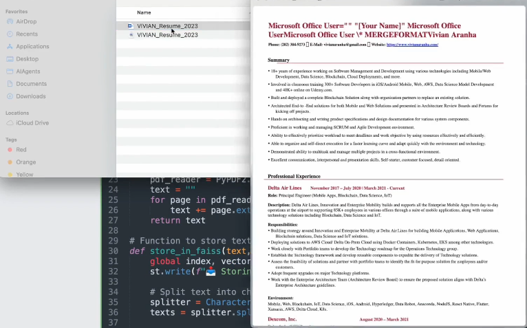
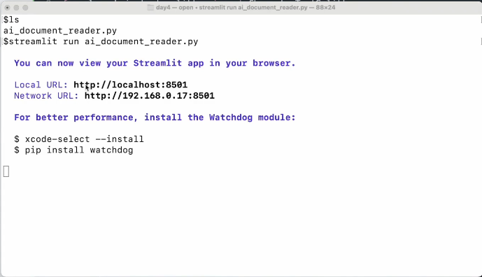
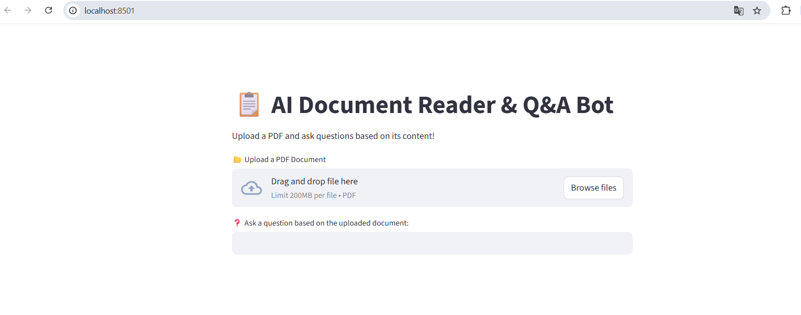
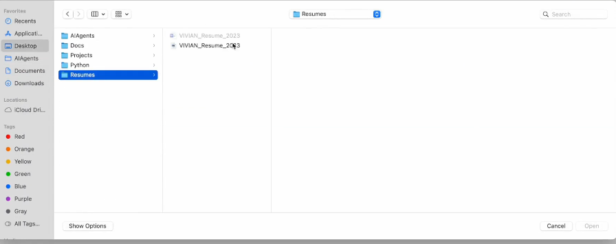
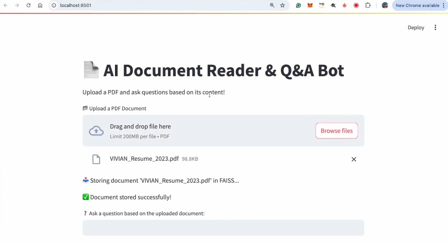
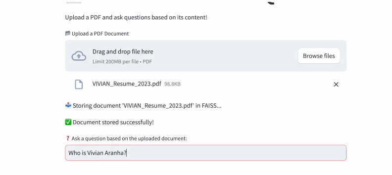
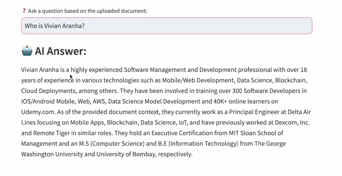

# Ejecutar el Lector de Documentos de IA

Ahora que hemos implementado el código, y también entendimos cómo debería funcionar el lector de documentos de IA, nos toca ejecutar el lector a ver si funciona.

Ahora, para iniciar el lector de documentos impulsado por IA, tendremos que dirigirnos a nuestra terminal con la ruta donde se encuentra nuestro archivo:

*C:\Users\alumno\Desktop\AIAgents\Day4>*

Una vez que estemos, ejecutaremos:

```bash
streamlit run ai_document_reader.py
```

Antes de ejecutarlo, si miramos el escritorio, tengo una carpeta de Currículums que tiene 2 currículums:



Vemos que uno está en formato Doc y otro en formato PDF.

Dado que nuestra aplicación sólo puede leer PDF, veamos cómo se ve.

Así que asegurémonos con el comando "ls" de que está el archivo, y luego lo ejecutamos:



Esto se ejecutará en un segundo. Y aquí se abrió en el navegador:



Dice localhost:8501. Y ahí lo tienes. Tenemos nuestro lector de documentos y bot de preguntas y respuestas.

Sube un PDF y haz preguntas basadas en su contenido. Y me da la opción de subir un documento PDF. Voy a proceder y decir "Buscar archivos" e ir a mi escritorio donde tengo mis currículums:



Y, si ves el documento de Word, no está disponible para subir, pero solo PDF porque hemos dicho específicamente que podemos obtener formato PDF.



Ahora está almacenado el documento. "Vivian_resume_2023.pdf" es un documento almacenado con éxito.

Ahora hacemos una pregunta basada en el documento subido y diremos "Quién es Vivian Arana?":



Lo ejecutamos. Ahora va a proceder e ir a la primera base de datos y luego tratar de obtener el valor más cercano basado en lo que he preguntado y generar una respuesta de ahí. Así que démosle unos minutos.

Resultado esperado:



Nos pone: "Vivian Arana es una profesional con mucha experiencia en gestión y desarrollo de software, con más de 18 años de experiencia en diversas tecnologías como desarrollo web móvil, ciencia de datos, blockchain..." Y muchas cosas más.

Así que me cuenta todo sobre Vivian Arana aquí mismo. Basado en el CV o el documento PDF que he subido. 

Espero que hayas podido seguir y obtener este mismo resultado basado en el código que hemos escrito.

Anterior página: Cómo funciona el Lector de Documentos de IA --> [**Click aquí**](./04c_FuncionLector.md)

Siguiente página: Habilitar la Descarga de Archivos de Reportes Resumidos por IA --> Proximamente...