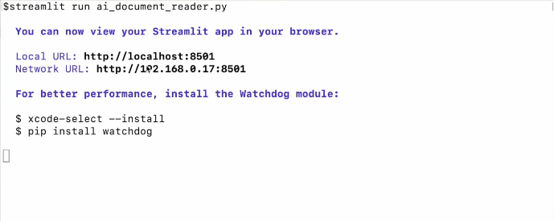
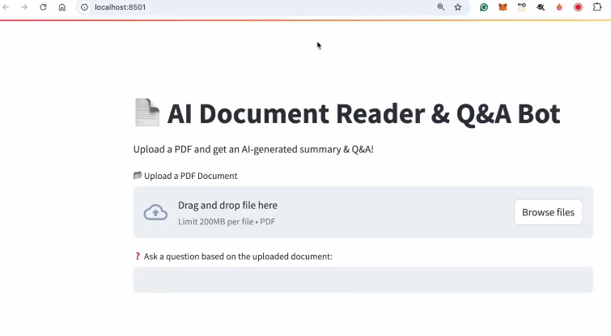
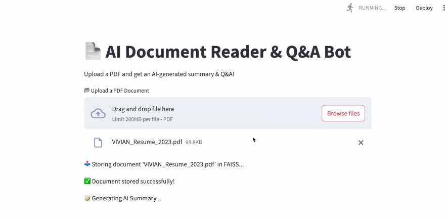
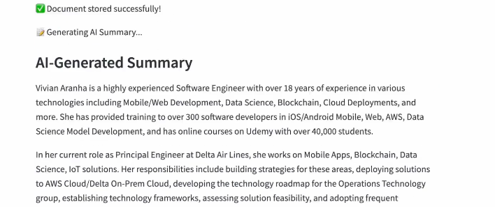
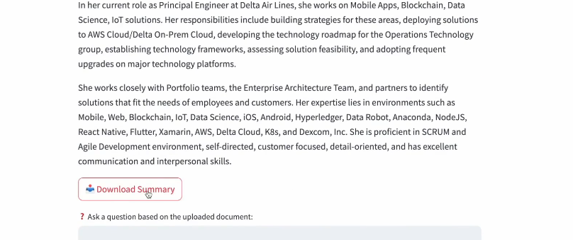
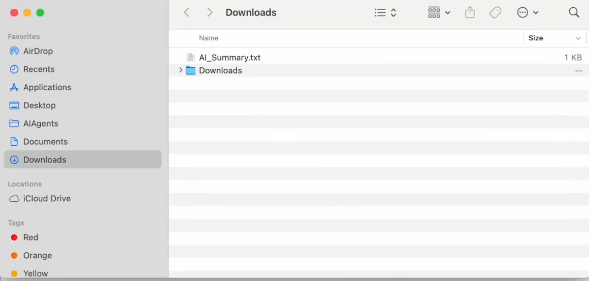
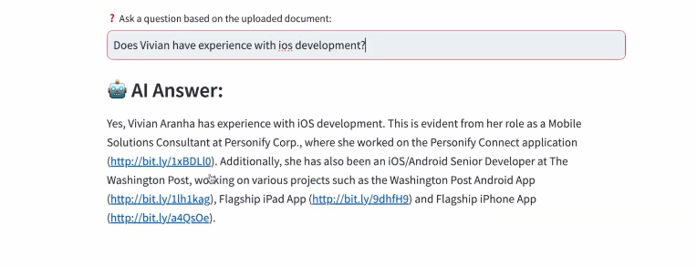

# Habilitar la Descarga de Archivos de Reportes Resumidos por IA

Aquí vamos a mejorar nuestro lector de documentos de IA permitiendo la descarga de archivos de los informes del Resumidor de IA.

Lo que vamos a hacer aquí es:

- *Modificar nuestro lector de documentos de IA* para que:

1. Primero resuma el documento subido usando IA.

2. Luego permitiremos a los usuarios descargar el resumen generado por IA como un archivo de texto en este caso particular.

Así que vamos a modificar el lector de documentos de IA actual que hemos escrito para soportar la descarga de archivos.

Así que las cosas que vamos a cambiar lo trabajaremos con el mismo archivo. O si prefiere, podemos crear un nuevo archivo que tenga la misma estructura de nuestro archivo y trabajar desde ese archivo. 

## Importaciones

Nuestras importaciones se mantienen igual.

## Carga de IA

Nuestra carga de modelo de IA se mantiene igual "llm = OllamaLLM(model='mistral')".

## Vectores 

En la línea debajo de los vectores "vector_store={}", crearemos una variable que la llamaremos:

```py
summary_text = ""
```

Después de esto, usaremos la función "extract_text_from_pdf". Se mantiene igual, el almacenamiento en archivos se mantiene igual, así que nada cambia en esos.

Pero, debajo de la función, vamos a crear otra función para *generar un resumen de IA*.

```py
# Function to generate AI Summary
def generate_summary(text): #1
    global summary_text #2
    st.write("📋 Generating AI Summary...") #3
    summary_text = llm.invoke(f"Summarize the following document:\n\n{text[:3000]}") # Limit input size #4
    return summary_text #5
```

1. Llamamos a la función "generate_summary" que tiene como entrada el texto.

2. Hacemos el resumen global, por lo que está disponible en toda la aplicación.

3. Escribimos en la interfaz web que genere el resumen de la IA.

4. Para el texto, vamos a tomar el documento y lo resumiremos a 3000 carácteres (:3000).

5. Devolvemos el texto del resumen.

Así que eso es todo lo que necesito hacer para generar el resumen

La función de recuperar y responder ("retrieve_and_answer") se permanece exactamente igual. No hay nada que cambie aquí.

Pero también neesitamos una función para permitir la descarga de archivos:

```py
# Function to allow file 
def download_summary(): #1
    if summary_text: #2
        st.download_button( #3
            label="📩 Download Summary",
            data=summary_text,
            file_name="AI_Summary.txt",
            mime="text/plain",
        )
```

1. Llamaremos a la función "download_summary"

2. Condición si existe el texto del resumen.

3. En caso afirmativo, se mostraría un botón de descarga para el resumen del contenido con nombre de archivo nuevo "AI_Summary.txt".

Ahora, aparte de esto, lo que cambia aquí es nuestra interfaz web de Streamlit.

Así que iremos a comentar esta parte del código y escribiremos lo siguiente:

```py
# st.write("Upload a PDF and ask questions based on its content!")
st.write("Upload a PDF and get an AI-generated summary & Q&A!")
```

Luego tenemos el cargador de archivos para PDF ("File uploader for PDF") que te permite subir archivos PDF. 

```py
# File uploader for PDF
uploaded_file = st.file_uploader("📂 Upload a PDF Document", type=["pdf"])
if uploaded_file:
    text = extract_text_from_pdf(uploaded_file)
    store_message = store_in_faiss(text, uploaded_file.name)
    st.write(store_message)

    # Generate AI Summary
    summary = generate_summary(text)
    st.subheader("AI-Generated Summary")
    st.write(summary)
```

Así que eso es lo que especificaré como el subencabezado.

A continucación del subencabezado, se mostrará el resumen. Así que eso está bien.

Luego después, aún dentro de la condición, vamos a habilitar la descarga de archivos para el resumen:

```py
    # Enable File Download for Summary
    download_summary()
```

Llamamos a la función que creamos antes para habilitar la descarga de archivos. 

En la entrada de usuario ("User input for Q&A") se mantendrá eso igual.

Entones el resto de las cosas se mantienen igual, así que vamos a guardar el archivo que hemos creado o modificado.

## Funcionalidad

Ahora hablemos de cómo funciona este lector de documentos de IA mejorado.

- El usuario sube un documento PDF.

- La IA extrae y almacena el texto en archivos.

- Finalmente la IA genera un resumen. 

**function generate_summary**: Aquí genera un resumen del documento, y los usuarios pueden descargar el resumen como un archivo de texto. Después los usuarios pueden hacer preguntas y la IA proporcionará respuestas.

Lo único que hemos añadido es la creación de un resumen del documento tan pronto como se sube.

Así que guardamos el archivo y seguimos.

## Prueba

Volvemos a nuestro terminal con nuestra ruta:

*C:\Users\alumno\Desktop\AIAgents\Day4>*

Y ejecutaremos el comando:

```bash
streamlit run ai_document_reader_report.py
```

Vemos que ahora se está ejecutando:



Nos abre nuestro navegador automáticamente y esperamos a que nos cargue la página:



Ahí va un lector de documentos IA con bot de preguntas y respuestas, y me permite explorar archivos.

Vamos a probar de nuevo subir mi currículum y lo va a almacenar:



Y si ves, tan pronto como se almacena, comenzó a generar el resumen de IA. Va a tomar unos segundos porque va a volver a Ollama, dar este texto y luego obtener el resumen e imprimirlo aquí.

Y ahí lo tienes:



Tenemos un resumen basado en el currículum que se subió. Además cuenta con una opción de "Descargar Resumen":



Descarga el resumen en el navegador. Si voy a mi carpeta de descargas, puedes ver que hay un resumen de IA que es el texto que se generó está descargado.



Y puedo ir y hacer preguntas a la IA, preguntando "Tiene Vivian experiencia con desarrollo de iOS?". Y después de unos minutos rebuscando información del currículum nos saldría este resultado:



Esto es evidente por su papel como consultroa de soluciones móviles en Personify Corp, donde trabajó en la aplicación Personify Connect, además de iOS, cualquier aplicación de Washington Post...

Así que obtuvo eso de los roles del CV y responsabilidades de algunos de los lugares donde trabaja en las aplicaciones, y me dió esa respuesta de vuelta ahí.

Así que espero que hayas podido seguir y aplicar esta mejora de tener un informe resumido del archivo que descargaste junto con la sesión de preguntas y respuestas que logramos anteriormente.

Anterior página: Ejecutar Lector de Documentos de IA --> [**Click aquí**](./04d_ExeDocumentReader.md)

